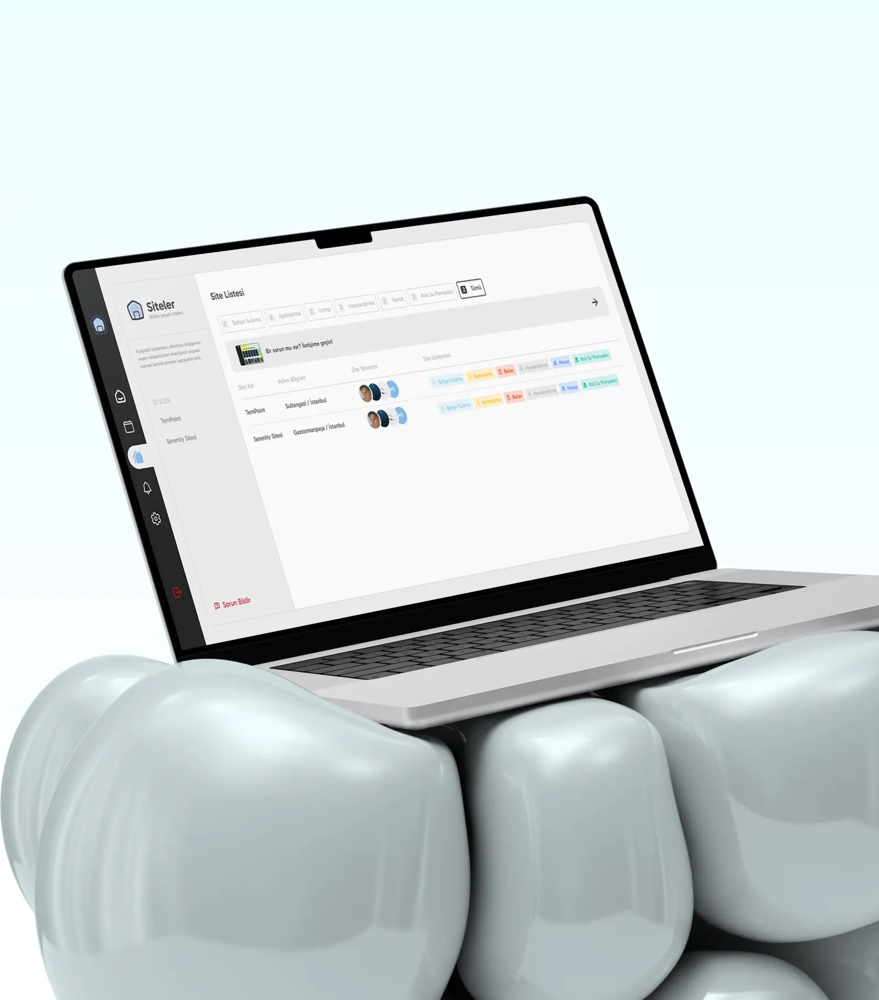

# [ yeqq ] Portfolio

Yunus Emre Korkmaz'in kisisel portfolio sitesi. Tasarimci bakisi ile front-end muhendisligini bir araya getiren, case study odakli, animasyonlu ve iki dilli bir React uygulamasi.



## Genel Bakis

Bu portfolio; belediye servisleri, sosyal fayda odakli mobil uygulamalar, startup urunleri ve kurumsal web deneyimleri uzerinden tasarim, front-end gelistirme ve UI/UX dusunme bicimini anlatir.

Sitenin ana fikri sade: az arayuz, guclu ritim, net kararlar. Buyuk tipografi, beyaz alan, proje gorselleri, mikro etkilesimler ve olculebilir proje sonuclari portfolio deneyiminin merkezinde yer alir.

## One Cikanlar

- React 18 ve Vite ile gelistirilmis modern front-end yapi.
- GSAP, ScrollTrigger, SplitType ve Lenis ile akici sayfa gecisleri ve scroll animasyonlari.
- Turkce/Ingilizce dil destegi icin i18next ve browser language detection.
- Proje filtreleme, detay sayfalari, case study metrikleri ve galeri akisi.
- Mobil ve web projeleri icin ayrilmis gorsel asset yapisi.
- Formspree entegrasyonlu iletisim formu.
- `prefers-reduced-motion`, skip link ve focus-visible gibi erisilebilirlik detaylari.
- Vite manual chunks ile React ve GSAP vendor ayrimi.

## Sayfalar

| Route | Aciklama |
| --- | --- |
| `/` | Ana sayfa, intro, ozet hakkimda, secili isler, ilkeler ve iletisim cagrisini icerir. |
| `/about-me` | Kisisel hikaye, calisma yaklasimi, tech stack ve cizim tabanli "discover me" etkilesimi. |
| `/projects` | Tum projeler, filtreler ve case study kartlari. |
| `/projects/:slug` | Tekil proje detaylari, rol/sirket/tur/teknoloji bilgileri, basari metrikleri ve galeri. |
| `/manifest` | Tasarim ve karar verme yaklasimini anlatan deneysel manifesto alani. |
| `/manifest/:slug` | Manifesto konseptlerinin uzun form yazilari. |
| `/contact-me` | Iletisim formu, e-posta ve sosyal baglantilar. |

## Secili Projeler

- **Skynotech Smart Site Systems**: IoT tabanli site yonetim platformu, MVP teslimi, cihaz yonetimi ve operasyonel verimlilik metrikleri.
- **Skynotech Corporate Website**: Marka kimligi, kurumsal web varligi ve design system uygulamasi.
- **Balikesir Digital Employment Platform**: Belediye odakli istihdam platformu, performans ve erisilebilirlik metrikleri.
- **Balikesir Event App**: Genclik etkinlikleri icin React Native mobil uygulama deneyimi.
- **Yakin Kart**: Sosyal finansal destek sureclerini dijitallestiren mobil uygulama.
- **BAPKA Website**: Kurumsal yeniden tasarim, SEO ve icerik stratejisi.
- **Askida Fatura**: Anonim yardimlasma ve fatura odeme akisi.
- **Can Dostlar**: Sahiplenme surecini seffaflastiran sosyal fayda uygulamasi.
- **Balikesir Eczane**: Nobetci eczane bulma ve acil durum odakli mobil akis.

## Teknoloji

| Alan | Teknolojiler |
| --- | --- |
| Core | React, React DOM, Vite |
| Routing | React Router |
| Animasyon | GSAP, ScrollTrigger, CustomEase, SplitType |
| Scroll | Lenis |
| Dil | i18next, react-i18next, i18next-browser-languagedetector |
| UI | CSS Modules, custom design tokens, React Icons |
| Form | Formspree |
| Gorsel optimizasyon | WebP asset setleri, responsive `srcSet`, lazy/eager image loading |

## Proje Yapisi

```txt
src/
  animations/        # Acilis, skeleton ve sayfa ici animasyon bilesenleri
  components/        # Ortak kart, link, loading, split text ve reveal bilesenleri
  hooks/             # Proje cursor, proje verisi ve reveal hook'lari
  layouts/           # Navbar, footer ve genel sayfa layout'u
  locales/           # TR/EN ceviri dosyalari
  pages/             # Home, About, Projects, Project detail, Manifest, Contact
  styles/            # Global stiller, reset, fontlar ve renk degiskenleri
  ui/                # Button, input, checkbox, menu gibi temel UI parcalari
  utils/             # Proje verisi, renk ve motion yardimcilari
public/
  assets/            # Proje gorselleri, banner'lar, videolar, fontlar ve ikonlar
```

## Kurulum

```bash
npm install
npm run dev
```

Yerel gelistirme sunucusu varsayilan olarak:

```txt
http://127.0.0.1:5173/
```

## Uretim Derlemesi

```bash
npm run build
npm run preview
```

Bu repo Vite kullandigi icin eski Create React App komutlari (`npm start`, `npm test`, `npm run eject`) bu proje icin gecerli degildir.

## Notlar

- Ana proje verisi [src/utils/projects.js](src/utils/projects.js) dosyasinda tutulur.
- Dil metinleri [src/locales/tr.json](src/locales/tr.json) ve [src/locales/en.json](src/locales/en.json) icindedir.
- SEO giris noktalari `index.html`, `public/sitemap.xml`, `public/robots.txt` ve `public/manifest.json` uzerinden yonetilir.
- Canli domain meta verilerde `https://yeqq.com.tr/` olarak tanimlanmistir.

## Tasarim Yaklasimi

Portfolio, klasik "kart ve kahraman alan" yapisinin disina cikarak daha editorial ve deneysel bir dil kurar. Bosluk, yavas acilan animasyonlar, buyuk tipografi, kisilikli mikro etkilesimler ve proje metrikleri birlikte kullanilir. Amac yalnizca isleri listelemek degil; dusunme bicimini, tasarim kararlarini ve uygulama disiplinini hissettirmektir.

## Lisans

Bu proje kisisel portfolio calismasidir. Tasarim, metinler ve gorsel varliklar Yunus Emre Korkmaz'a aittir.
